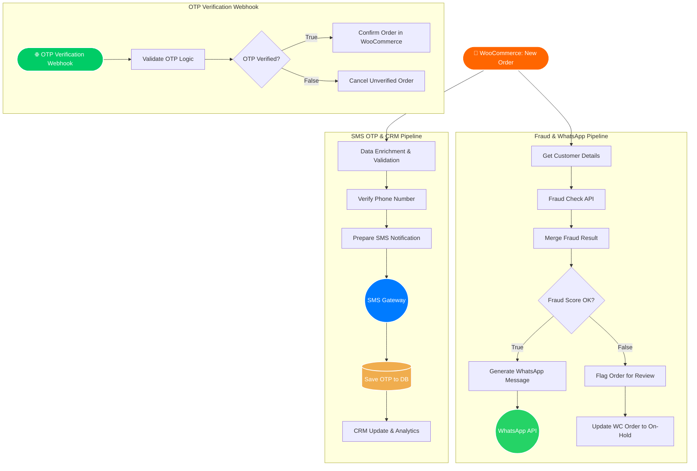

# 🛒 Automated WooCommerce OTP & Fraud Prevention System

An intelligent, n8n-powered backend automation workflow designed to intercept new WooCommerce orders, conduct third-party fraud checks, and verify user identities via WhatsApp and SMS OTPs.

**Industry:** E-commerce  
**Project Duration:** 1-7 days  
**Estimated Value:** $800 - $1,000  

---

## 📋 Project Overview

### 🎯 Client Goal
An e-commerce business was losing significant revenue due to a high volume of fake Cash-On-Delivery (COD) orders. They needed a robust, automated verification system to authenticate real customers.

### 🚧 Challenges
The client needed a seamless way to verify user identities **without disrupting the checkout flow** on their website, while securely connecting this verified data to a custom CRM.

### 💡 Solution
Designed a fully automated backend workflow to intercept new WooCommerce orders. Instead of relying on heavy plugins, custom API integrations were built to trigger automated WhatsApp and SMS OTP verification processes. A custom CRM dashboard was also engineered to track verified leads in real-time.

### 📈 Result
**Reduced fake orders by 95%**, saving the business thousands of dollars in wasted shipping costs and operational overhead.

---

## 🏗️ System Architecture & Workflow

Here is the architectural flow of how the system processes new orders and verifies the OTP.

⚙️ How It Works
The system is divided into two primary n8n workflows:

1. Order Processing & OTP Dispatch
Trigger: A webhook intercepts a new order creation event from WooCommerce.

Parallel Processing: The workflow splits into two parallel branches:

Branch A (Fraud Check): Runs customer details through a third-party fraud check API. If the score is safe, it sends an order confirmation via the WhatsApp API. If suspicious, the order status is automatically changed to "On-Hold" for manual review.

Branch B (OTP Generation): Validates the phone number, generates a unique OTP, and dispatches it via a third-party SMS Gateway. The generated OTP is securely saved to a database and logged in the custom CRM.

2. OTP Verification & Order Confirmation
Trigger: The customer enters the OTP on the frontend, hitting the verification webhook.

Validation: The system checks the submitted OTP against the database.

Action: - If True: The WooCommerce order status is updated to "Processing/Confirmed".

If False: The order is marked as "Cancelled" or flagged.

🛠️ Tech Stack & Tools
n8n: Core automation engine and workflow orchestration.

WooCommerce / WordPress: E-commerce platform (Trigger & Action source).

WhatsApp Cloud API: For automated messaging.

Bulk SMS Gateway: For OTP delivery.

Custom Database / CRM: For storing OTPs and displaying real-time analytics.

Third-Party Fraud API: For risk scoring.

👨‍💻 About the Developer
Built by Uba Chan - AI Automation Engineer & Vibe Coder

🌐 Portfolio: ubachan.site

📧 Contact: ubachan2025@gmail.com
